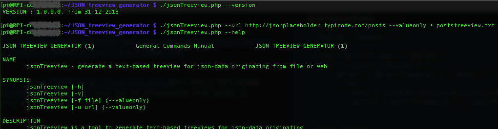

#  JSON treeview generator
 



## What

This command-line tool converts [JSON](https://www.json.org)-data into a text-based treeview. The [JSON](https://www.json.org)-data can be originating from either a (local) file or directly from a web-api.

## Why

When learning a new programming language, I prefer writing code which can actually serve in the future, instead of just writing hello world's. So, the language being [PHP](https://secure.php.net), I considered some web-related tool to be interesting enough.

## How

The code for this script has been written in PHP on [MacOS High Sierra](https://en.wikipedia.org/wiki/MacOS_High_Sierra) on the built-in PHP version [7.1](http://php.net/releases/7_1_0.php). It has been tested in parallel on a [Raspbian](https://www.raspberrypi.org/downloads/raspbian/) [Stretch](https://www.raspberrypi.org/blog/raspbian-stretch/) with PHP [7.0](http://php.net/releases/7_0_0.php). The script only uses PHP built-in functionalities. As such, there are no references to any external libraries.

The script loads JSON-data from either a file or a web-source. A recursive function iterates over the data, and outputs a human-readable text-based treeview. More details are to found in the [code section](#code)

## Progress status

 - [x] have an [idea](#what), and a [reason](#why) why to make it
 - [x] decide on how it should [work](#how)
 - [x] write the [code](source/)  
 - [x] [test](#how) it properly
 - [ ] document the [source code](source/) and the important [snippets](#snippets)
 - [x] write a [user manual](#how_to_use_it)

## How to use it

The script can either be started by passing it as an argument to the php interpreter

`$ > php jsonTreeview.php [required arguments] {options}`

or directly as an application

`$ > ./jsonTreeview.php [required arguments] {options}`

The script contains a shebang on the first line which is optimised for linux based OS's. For other OS's, it might be necessary to replace `#!/usr/bin/php` by `#!/usr/bin/env php`. Do not forget to make the script executable : `$ > chmod +x jsonTreeview.php`.

Starting the application with the `--help` option as argument will display the concerning [linux man page](https://en.wikipedia.org/wiki/Man_page). Always refer to the [man page](https://en.wikipedia.org/wiki/Man_page) which is generated by the script you are running for the most relevant instructions (i.e. specific availability of options for the version you are running).

`$ > php jsonTreeview.php --help`

```
JSON TREEVIEW GENERATOR (1)            General Commands Manual            JSON TREEVIEW GENERATOR (1)

NAME
       jsonTreeview - generate a text-based treeview for json-data originating from file or web

SYNOPSIS
       jsonTreeview [-h]
       jsonTreeview [-v]
       jsonTreeview [-f file] {--valueonly}
       jsonTreeview [-u url] {--valueonly}

DESCRIPTION
       jsonTreeview is a tool to generate text-based treeviews for json-data originating
       from either a file or a web-API.

       Options -f and -u, followed by either a path/filename or a web-address, will allow
       the tool to go get the json-data to transform into a text-based treeview, as
       displayed below :

       http://www.thewebaddress/data.json or /pathname/filename.json
             |_firstelementkey
                |_firstdatalinekey : 1234
                |_seconddatalinekey : abcde
                |_...
             |_secondelementkey
                |_firstdatalinekey : 5678
                |_seconddatalinekey : fghij
                |_...
             |_...

       The root tag of the treeview will refer to the origin of the json-data.
       Collection headers will display the key as label.
       Branch ends will display key/value pairs.

       When adding the --valueonly option to the commandline, a treeiew with only element values
       will be generated (no key labels). Collection headers will be labeled ARRAY.

       The -h option will display this help text.

       The -v option will display the tools software version number.

OPTIONS
       -h -H --help           display this help message
       -v -V --version        display this application's version
       -f -F --file           generate a treeview from the json-data in the file
       -u -U --url            generate a treeview from the json-data retrieved from the url
             --valueonly      generate a treeview with values only (no key labels)

DIAGNOSTICS
       Informative messages will be displayed when the application is called in
       an incorrect way (i.e. missing/unkown/invalid parameters)

AUTHOR
       This tool was created by The Nostradomus Engineering Team, for quick analysis
       of json-data from web-APIs. We can be contacted through
       http://nostradomus.ddns.net/contactform.html for any questions.
```

## Technical details

### [](https://secure.php.net) Programming language

The code has been written in [PHP](https://secure.php.net). The minimum required version is PHP 5.3, due to the use of [HereDoc](https://en.wikipedia.org/wiki/Here_document#PHP)/[NowDoc](http://php.net/manual/en/language.types.string.php). The script has however been tested to work correctly up to version 7.

### Code

The full source code is available in the [source folder](source/) :

version  | name             | description
---------|------------------|--------------------------------------------------------------------------------------------
v1.0.0.0 | jsonTreeview.php | initial version

### Snippets

#### Retrieving the data

Coming soon.............

#### Building the treeview with recursion

The standard recursive function which will output the treeview takes to arguments :
 - $dict : the dictionary/collection/array with the key/value pairs to process
 - $level : the branch depth-level of the root element of $dict

When iterating, the keys (or labels) will be preceded with the appropriate branch lines. When the value associated to a key concerns a list (one more level down), only the key will be added to the treeview, and the function will recursively call itself to 'dig deeper' in the data. When an end element is detected, both the key and the value will be added to the treeview.

The output of the function is a multiline string.

```PHP
// recursive iterator to build a text-based treeview with key/value pairs
function iterateArray($dict,$level) {
    $spaces = '';
    for ($i = 0; $i <= ($level*3); $i++) {
        $spaces = $spaces.' ';
      }
    $branch = '';
    foreach($dict as $key => $value) {
        if (!(is_array($value))) {
          $indent = '';
          for ($i = 0; $i <= (strlen($key)+3); $i++) {
              $indent = $indent.' ';
            }
          $value = str_replace("\n","\n ".$spaces.$indent,$value);
          $branch = $branch.$spaces."|_".$key." : ".$value.PHP_EOL;
          } else {
              $next = iterateArray($value,($level+1));
              $branch = $branch.$spaces."|_".$key.PHP_EOL.$next;
             }
    }
    return $branch;
  }
```

When adding the `--valueonly` options to the command-line arguments list, and alternative function is called, which is based on a PHP built-in iterator and treeview generator. This function only takes the data-collection as an argument.

This function outputs a similar type of multiline string, with a slightly different layout, and only values as data.

```PHP
// value-only treeview generator based on language built-in iterators
function iterateValues($dict) {
    $tree = '';
    $json2list = new RecursiveArrayIterator($dict);
    $list2tree = new RecursiveTreeIterator($json2list);

    foreach( $list2tree as $key => $value ) {
        $tree = $tree.$value.PHP_EOL;
    }
    return $tree;
  }
```

## Contributors

If you are having any good suggestions, just drop me a line [:email:](http://nostradomus.ddns.net/contactform.html).
If feasible, I'll be happy to implement any proposed improvements.
And if you are having lots of time, I'll be happy to share the work with you ;-).

When you create your own version, don't forget to send us some nice pictures of your construction. We'll be happy to publish them in the :confetti_ball:Hall of Fame:confetti_ball:.

## :globe_with_meridians: License

At this moment, there is no specific license attached to this project.

So, today, if you like it, have fun with it (at your own risk of course :-D), and especially, be creative.

Oh, and when using anything from this repository, it is highly appreciated if you mention its origin.

If you would like to use any of this work (or the whole project) for commercial use, first [contact us :email:](http://nostradomus.ddns.net/contactform.html), so we can add the appropriate license, which best fits your business.
